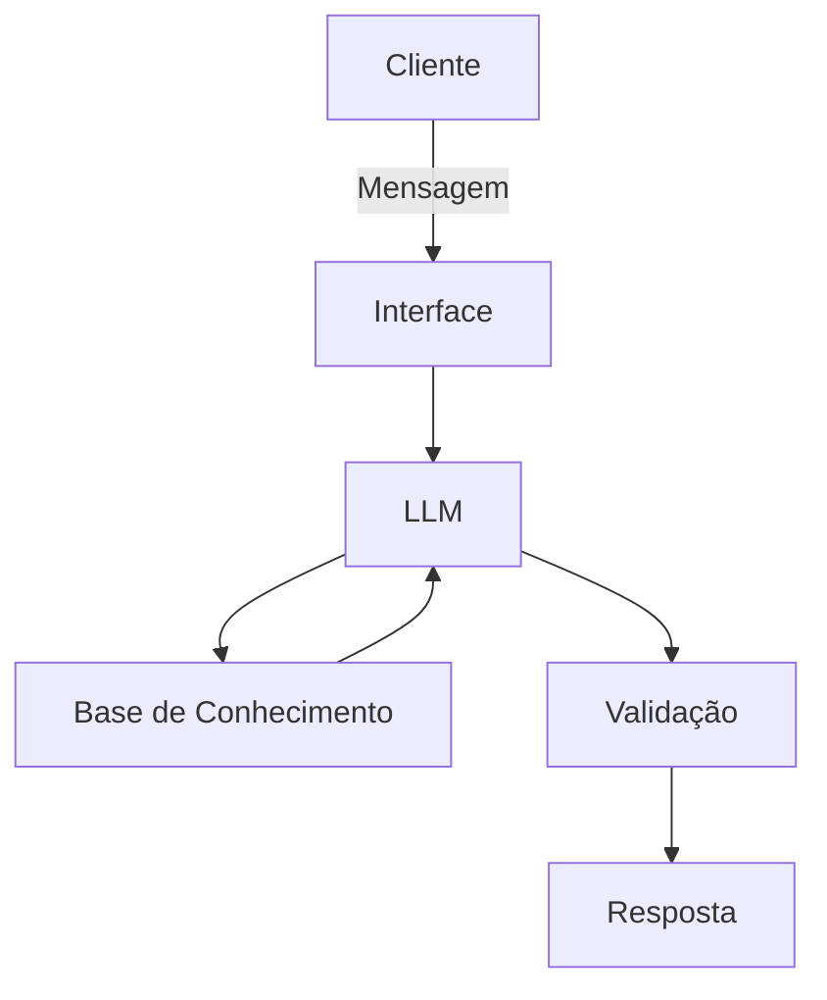

# Documentação do Agente

## Caso de Uso

### Problema
> Qual problema financeiro seu agente resolve?

Muitos usuários não conseguem compreender sua própria vida financeira de forma clara e estruturada. Eles têm dificuldade em identificar padrões de gastos, entender se estão economizando ou gastando em excesso e escolher investimentos adequados ao seu perfil. Além disso, a informação financeira costuma ser fragmentada e pouco personalizada, o que dificulta a tomada de decisão.

### Solução
> Como o agente resolve esse problema de forma proativa?

O agente atua como um consultor financeiro pessoal inteligente, analisando automaticamente o histórico de transações e o perfil do investidor do usuário. Ele identifica padrões de consumo, alerta sobre comportamentos financeiros relevantes (como aumento de gastos ou baixa capacidade de investimento) e sugere ações personalizadas.

Diferente de um chatbot reativo, ele:

* Antecipará problemas financeiros (ex: excesso de gastos em lazer)
* Sugerirá ajustes de orçamento
* Indicará produtos financeiros adequados ao perfil do usuário
* Explicará decisões de forma simples e consultiva

### Público-Alvo
> Quem vai usar esse agente?

Pessoas que querem organizar suas finanças pessoais
Usuários iniciantes em investimentos
Clientes de bancos digitais ou fintechs
Jovens adultos buscando educação financeira prática
Usuários que desejam acompanhamento financeiro automatizado

---

## Persona e Tom de Voz

### Nome do Agente
FinBot (Assistente Financeiro Inteligente)

### Personalidade
> Como o agente se comporta? (ex: consultivo, direto, educativo)

O FinBot é um assistente consultivo, analítico e proativo. Ele não apenas responde perguntas, mas interpreta dados financeiros e sugere melhorias. Ele age como um assessor financeiro digital, sempre com foco em clareza, responsabilidade e personalização.

### Tom de Comunicação
> Formal, informal, técnico, acessível?

O tom é acessível e levemente consultivo, evitando jargões técnicos. O objetivo é educar sem complicar, mantendo uma linguagem clara e objetiva, adequada para usuários com diferentes níveis de conhecimento financeiro.

### Exemplos de Linguagem
- Saudação: [ex: "Olá! Como posso ajudar com suas finanças hoje?"]
- Confirmação: [ex: "Entendi! Deixa eu verificar isso para você."]
- Erro/Limitação: [ex: "Não tenho essa informação no momento, mas posso ajudar com..."]

---

## Arquitetura

### Diagrama

### Componentes

| Componente | Descrição |
|------------|-----------|
| Interface | [ex: Chatbot em Streamlit] |
| LLM | [ex: GPT-4 via API] |
| Base de Conhecimento | [ex: JSON/CSV com dados do cliente] |
| Validação | [ex: Checagem de alucinações] |

---

## Segurança e Anti-Alucinação

### Estratégias Adotadas

- [ ] [ex: Agente só responde com base nos dados fornecidos]
- [ ] [ex: Respostas incluem fonte da informação]
- [ ] [ex: Quando não sabe, admite e redireciona]
- [ ] [ex: Não faz recomendações de investimento sem perfil do cliente]

### Limitações Declaradas
> O que o agente NÃO faz?

Não realiza operações financeiras reais (apenas simulações e recomendações)
Não acessa dados externos em tempo real (ex: mercado financeiro ao vivo)
Não substitui consultoria financeira profissional certificada
Não garante retorno financeiro sobre recomendações
Não faz previsões exatas de mercado ou investimentos
Não toma decisões automáticas em nome do usuário
